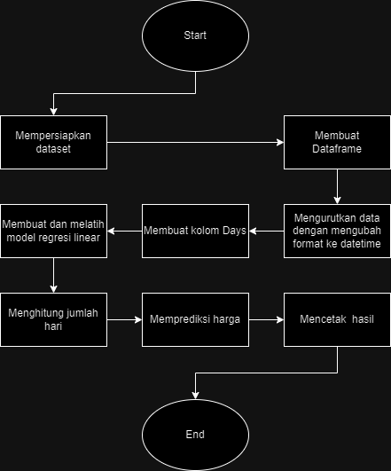

# ML-A11.2022.13993-UAS

Judul:PREDIKSI HARGA SAHAM BANK MANDIRI PERSERO TBK PT (BMRI) DENGAN REGRESI LINEAR

Nama : RIFAN SAIFUDIN

NIM  : A11.2022.13993

Kelm : A11.4419

Ringkasan:
Di proyek kali ini saya bertujuan untuk memprediksi harga saham Bank Mandiri Persero Tbk PT (BMRI) menggunakan metode regresi linear.

Permasalahan:
Meskipun telah ada berbagai pendekatan untuk memprediksi harga saham, masih ada tantangan dalam menciptakan model yang akurat dan dapat diandalkan.

Tujuan yang Akan Dicapai:
Membangun model yang dapat memprediksi harga saham bank Mandiri dengan akurasi yang tinggi menggunakan model regresi linier.

Model / Alur Penyelesaian:

Diskusi Hasil:
Nilai Mean Squared Error (MSE) dari model adalah 'mse' dan nilai R-squared adalah 'r2'. Ini mengindikasikan seberapa baik model memprediksi harga penutupan saham berdasarkan fitur-fitur yang digunakan.

Kesimpulan:
Model regresi linier dapat memperkirakan harga penutupan saham dengan baik. Namun, kinerja model bisa ditingkatkan dengan menambah jumlah data atau mencoba algoritma machine learning lainnya.
